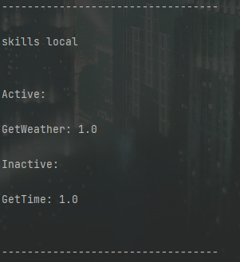
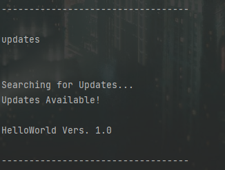
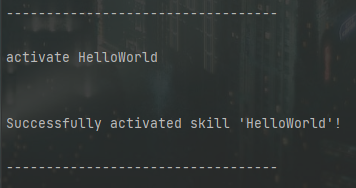

Bevor ich das Webinterface erstellt habe, konnte man Skills lediglich über disses CLI (**C**ommand **L**ine **I**nterface) installieren und verwalten.  
Die Bedienung über das Webinterface ist natürlich sehr viel einfacher und bietet auch einige Extrafunktionen, allerdings wollte ich das CLI nicht unkommentiert lassen.

## Befehle

Mit dem CLI kann man verschiedene Funktionen des Skillmanagers nutzen.  
Dazu habe ich einige Befehle definiert.

Mit ``skills remote`` kann man sich alle auf dem Server verfügbaren Skills anzeigen lassen.  
Wohingegen man sich mit dem Befehl ``skills local`` anzeigen lassen kann, welche Skills in welcher Version derzeit installiert und aktiviert sind.  
``updates`` zeigt, ob es für einen lokal installierten Skill eine neue Version gibt.  

  
Hat man einen Skill gefunden, welchen man installieren möchte, so kann man mit dem Befehl ``download <Skill-Name> <Version>`` genau das tun.  
Dabei werden die Dateien heruntergeladen und einige Informationen in der ``skillConfigs.json`` gespeichert.  

Diesen Skill kan man jedoch noch nicht benutzen, dazu muss man den Skill erst mit ``activate <Skill-Name>`` bei Rhasspy registrieren.  
Mit dem Befehl ``deactivate <Skill-Name>`` kann man den Skill dann wieder deaktivieren.

  
Hat ein Skill "ausgedient" oder bringt unerwartete Probleme mit sich, kann man ihn mit ``delete`` löschen.  
Dabei werden auch alle Konfigurationen in der ``skillConfigs.json`` gelöscht.  

## Umsetzung

Um das CLI zu realisieren, nutze ich das integrierte NodeJS-Package [Readline](https://nodejs.org/api/readline.html).  
Diese Umsetzung ist recht primitiv und bietet nicht allzu viele Möglichkeiten.  
Allerdings ist das CLI auch nicht als Hauptbedienmöglichkeit meines Skillsystems gedacht.  
Dazu sollte man das [Webinterface](./webinterface.md) nutzen.