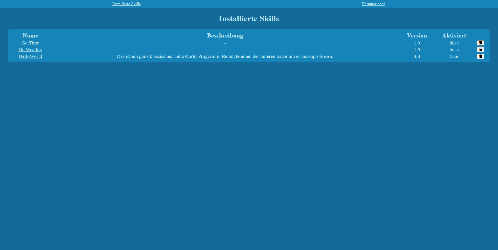

Um es dem Endnutzer zu erleichtern neue Skills zu installieren und verwalten, habe ich zusätzlich zum [CLI](./cli.md) ein Webinterface erstellt.  
Dieses Interface nutzt sämtliche Funktionen, die vom [Skillmanager](./skillmanager.md) bereitgestellt werden, um Informationen anzuzeigen und die Skills zu verwalten.

## Übersicht

Auf der Übersicht-Seite werden alle installierten Skills angezeigt.  
In der Tabelle sieht man eine kurze Zusammenfassung der wichtigsten Informationen, bestehend aus Name, Beschreibung, Version und ob der Skill aktiviert ist oder nicht.  
Außerdem kann man den jeweiligen Skill hier löschen.  

  
*Bild der Übersicht-Seite*

## Details
Auf dieser Seite befinden sich alle Informationen und Details die für den Endnutzer wichtig sind.  
Man erhält eine kleine Beschreibung des Skills und einige Sätze, die man verwenden kann, um den Skill zu benutzen.  
Außerdem kann man hier einige benötigte Optionen angeben.  
Am Beispiel des GetWeather-Skills wären das unter anderem die Stadt oder der API-Key.  
Ein Entwickler kann diese Optionen in der ``manifest.json`` angeben, gespeichert werden sie dann in der ``skillConfigs.json``.  

  
*Bild der Details-Seite*

```json
{
  "options": [
    {
      "name": "APIKey",
      "type": "String",
      "default": "Enter your API-Key here, please."
    },
    {
      "name": "city",
      "type": "Number",
      "default": 51789
    },
    {
      "name": "country",
      "type": "String",
      "default": "DE"
    },
    {
      "name": "language",
      "type": "String",
      "default": "de"
    },
    {
      "name": "units",
      "type": "String",
      "default": "metric",
      "choices": ["standard","metric", "imperial"]
    }
  ]
}
```  
*[GetWeather/manifest.json](https://github.com/fwehn/pp-voiceassistant/blob/main/src/server/skills/GetWeather/1.0/manifest.json)*

Zu guter Letzt kann man auf dieser Seite den jeweiligen Skill [aktivieren und deaktivieren](./skillmanager.md#skills-aktivieren).  
Das sorgt dafür, dass die Intents und Slots bei Rhasspy registriert werden und der Skill dadurch nutzbar gemacht wird.

## Download
Über das Webinterface kann man neue Skills von einem Server Herunterladen.  
Dabei kann man verschiedene Versionen auswählen.  
Hier werden die Funktionen genutzt, die ich [hier](./skillmanager.md#online) näher beschrieben habe.  

  
*Bild der Download-Seite*

## Upload
Auf dieser Seite kann man einen lokal gespeicherten Skill installieren und benutzen, ohne eine aktive Verbindung zum [Skillserver](./../server/skillserver.md) zu haben.  
Dazu gibt man einen Namen, eine Versionsbezeichnung und die jeweilige Skilldatei im Zip-Format an und klickt auf "Hochladen".  
Der [Skillmanager](./skillmanager.md#offline) kümmert sich im Hintergrund dann darum, dass die Zip entpackt wird und alle Dateien am richtigen Ort platziert werden.  
Nach dem Upload sollte der Skill dann auf der [Übersichtsseite](#bersicht) sichtbar und auswählbar sein.  

  

## Umsetzung
Das Webinterface wird von einem ExpressJS-Server bereitgestellt, welcher die [Jade Template-Engine](https://jade-lang.com/) verwendet, um zum einen verschiedene Templates zusammenzuführen, zum anderen Daten von NodeJS auf die statische Website bringt, ohne für jede Information einen eigenen REST-Endpoint erstellen zu müssen.  
Auf den HTML-Seiten selbst wird jeweils [VueJS](https://v3.vuejs.org/guide/introduction.html#what-is-vue-js) per [UNPKG-Link](https://unpkg.com/) eingebunden, um die durch Jade übertragenen Daten einfacher darzustellen.  

## Port
Ich habe mir die Frage gestellt, welchen Port man für das Webinterface benutzen könnte.  
Für allgemeine Testzwecke nutze ich in fast jedem Projekt den Port 2712 (mein Geburtsdatum), da dieser fast immer frei ist.  
Ich habe mir allerdings ein paar Gedanken gemacht, welchen Port man stattdessen nutzen könnte.  
Der Port sollte leicht zu merken sein.  
Dafür bietet sich ein Port an, der aus wiederkehrenden Zahlen besteht, wie z.B. 11111 oder 8080 (im Gegensatz zu 19294).  
Mögliche Ports die ich mir überlegt habe:
- 12321
- 12102 oder 12121 (abgeleitet vom standard Rhasspy-Port 12101)

Schlussendlich habe ich mich für den Port 12102 entschieden, da dieser in mehreren Onlinelisten unbelegt war.