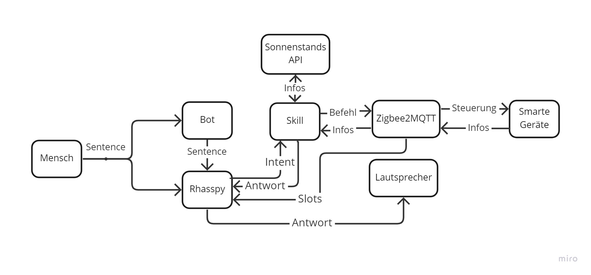

Der Automatisierungsskill ist der komplexeste Skill, der entwickelt wurde. Dies wird deutlich, wenn das Diagramm der Kommunikation aller Entitäten durch den Skill betrachtet wird.

Wie in diesem Diagramm zu erkennen ist, nutzt dieser Skill den Service Zigbee2MQTT und eine API. So wird in diesem Skill aufgezeigt wie mit solchen Entitäten kommuniziert werden kann.
Außerdem können in diesem Skill Eventlistener aktiviert werden. Dies sind Programme, welche ausgeführt werden, sobald das observierte Ereignis eintritt. In diesem Falle warten die Eventlistener auf Nachrichten von Zigbee2MQTT.  

Dieser Skill ist der einzige Skill der aufzeigt, das auch Prozesse durch den Sprachassistenten gestartet werden können, die keine weitere Interaktion durch den Sprachassistenten auslösen. 
