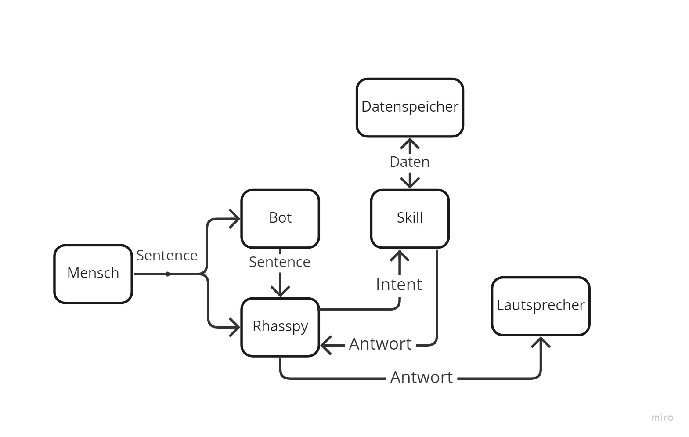

Der Skill GetTime ist der Skill mit der geringsten Komplexität der entwickelt wurde. Dies wird deutlich, wenn das Diagramm der Kommunikation aller Entitäten durch den Skill betrachtet wird.

Wie in diesem Diagramm zu erkennen ist, kommuniziert dieser Skill mit einem Datenspeicher. So zeigt dieser Skill auf, wie Daten persistent gespeichert werden können.
