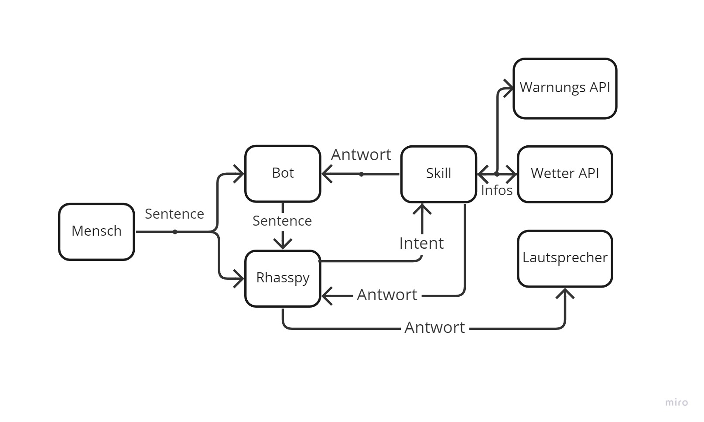

Der Wetterdienstskill besitzt eine geringe Komplexität. Dies wird deutlich, wenn das Diagramm der Kommunikation aller Entitäten durch den Skill betrachtet wird.

Wie in diesem Diagramm zu erkennen ist, kommuniziert dieser Skill mit zwei APIs und dem Chatbot. So zeigt dieser Skill auf, wie mit APIs kommuniziert und die Antworten aufbereitet werden können. Außerdem wird gezeigt, wie aus einem Skill über den Bot Nachrichten versendet werden können.
