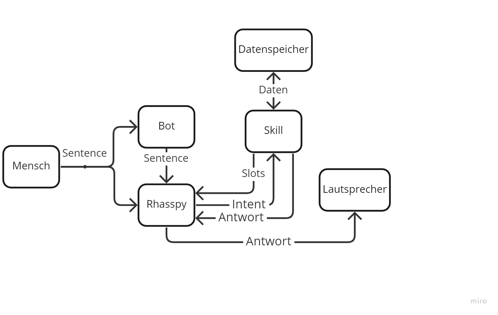

Der Listenskill besitzt eine moderate Komplexität. Dies wird deutlich, wenn das Diagramm der Kommunikation aller Entitäten durch den Skill betrachtet wird.

Wie in diesem Diagramm zu erkennen ist, kommuniziert dieser Skill einem Datenspeicher und dem Chatbot. So zeigt dieser Skill auf, wie Daten persistent gespeichert werden können. Außerdem wird gezeigt, wie aus einem Skill Informationen exportiert werden können. Dazu nutzt der Skill den Bot. Des weiteren kann dieser Skill Listen automatisch benennen und diese Namen an Rhasspy senden um sie dort als Sloteinträge zu registrieren. Ein Slot mit Listeneinträgen wird bei Start des Skills aus einer Datei eingelesen und an Rhasspy gesendet. Dadurch wird eine Personalisierung an möglichen Listeneinträgen realisiert.
