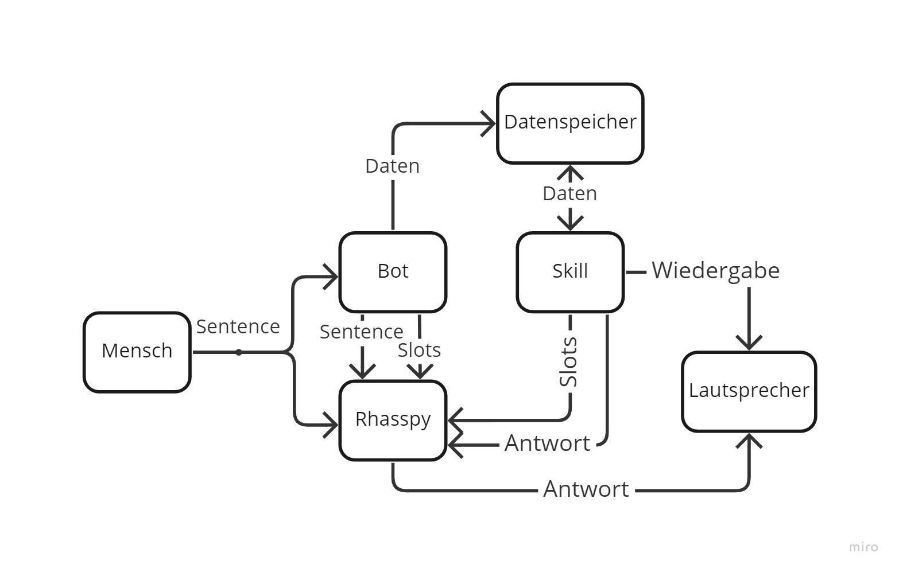

Der Musikplayerskill besitzt eine hohe Komplexität. Dies wird deutlich, wenn das Diagramm der Kommunikation aller Entitäten durch den Skill betrachtet wird.

Wie in diesem Diagramm zu erkennen ist, kommuniziert dieser Skill mit einem Datenspeicher und den Lautsprechern. So zeigt dieser Skill auf, wie Daten persistent gespeichert werden können. Außerdem wird gezeigt, wie aus einem Skill Audio abgespielt werden kann. Des weiteren liest dieser Skill beim Start zwei Dateien aus und sendet die enthaltenenen Namen als Slot Einträge an Rhasspy. Zur Laufzeit können auch über den Chatbot neue Einträge in den Slots bespeichert und an Rhasspy gesendet werden. Diese Einträge werden auch persistent gespeichert. 
