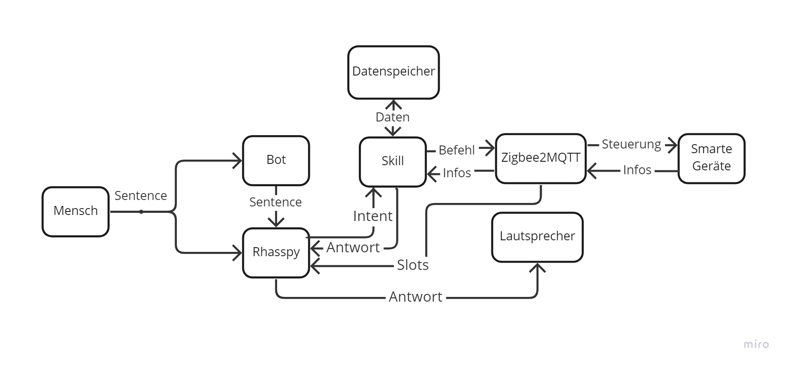

Der Smarthomeskill besitzt eine hohe Komplexität. Dies wird deutlich, wenn das Diagramm der Kommunikation aller Entitäten durch den Skill betrachtet wird.

Wie in diesem Diagramm zu erkennen ist, kommuniziert dieser Skill mit einem Datenspeicher und dem Dienst Zigbee2MQTT. So zeigt dieser Skill auf, wie Daten persistent gespeichert werden können. Außerdem wird gezeigt, wie ein Skill via Zigbee2MQTT Smarte Geräte steuern kann. Der Skill kann dabei auch Informationen anfordern und auf diese warten. Des weiteren kann dieser Skill Szenen automatisch benennen und diese Namen an Rhasspy senden um sie dort als Sloteinträge zu registrieren. Die generierten Namen werden auch persistent gespeichert. 