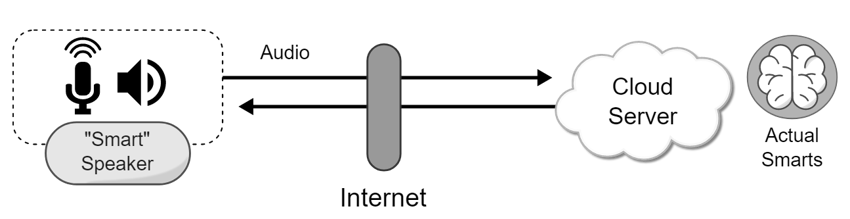
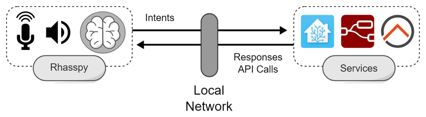

Bei Sprachassistenten handelt es sich um natürlichsprachliche Dialogsysteme. Sie erledigen Aufgaben für Nutzende durch Reaktion auf ihre Anfragen. Dabei gehen sie nach einem immer gleichen Schema vor.  

1. `Audio Input:` Der Sprachassistent nimmt kontinuierlich Audiomitschnitte auf.
2. `Wake Word:`   Das Aktivierungswort des Sprachassistenten. Erkennt der dies, wird der folgende Audiomitschnitt ausgewertet.
3. `Speech to Text:` Der Audiomitschnitt wird mithilfe eines Sprachmodells transkribiert.
4. `Intent Recognition:` Aus der transkribierte Eingabe wird ein Intent erkannt. Dabei werden auch Slot-Einträge extrahiert und mit dem Namen des Slots verbunden.
5. `Intent Handling:` Der Intent wird an den zugehörigen Skill weitergeleitet und dort verarbeitet.
6. `Text to Speech:` Falls der Skill eine Antwort auslöst, wird dieser in Textform vom Skill an das Text to Speech System weitergeleitet. Dort wird dieser in Sprache umgewandelt.
7. `Audio Output:` Die zu Sprache umgewandelte Antwort wird abgespielt.

Sprachassistenten können in einer Basis - Satellit (engl. Base - Satellite) Konfiguration genutzt werden. Dabei ist ein Satellit lediglich für die Schritte 1-2 und 7 verantwortlich. Die aufgenommenen Audiomitschnitte werden an die Basis zur Weiterverarbeitung gesendet. Die Basis schickt danach die Antwort zurück an den Satellit, wo sie abgespielt werden kann.

## Verschiedene Vorgehensweisen von Sprachassistenten

### Cloud

*[Bild von Rhasspy](https://rhasspy.readthedocs.io/en/latest/why-rhasspy/)*

Der cloudbasierte Ansatz stellt den Sprachassistent in einer Basis - Satellit Konfiguration zur Verfügung. Die Basis ist dabei ein Cloudserver, an welchen die Daten über das Internet gesendet werden. Dies hat den Vorteil, das die gesamte Verantwortung zur Verarbeitung des Gesprochenen beim Server liegt. Wenn neue Skills hinzugefügt werden sollen, reicht es diese dort zu installieren. Genauso wenn Fehler vorkommen, werden diese dort behoben. Außerdem wird das System nicht durch lokale Hardware limitiert. Zur Inbetriebnahme des Sprachassistents ist keine weitere Einrichtung neben der Herstellung einer Internetverbindung notwendig.  
Ein Nachteil dieses Ansatzes ist, dass die Nutzenden die Kontrolle über ihre Audiomitschnitte verlieren. Auf dem Cloudserver können diese auch zu weiteren Zwecken verwendet werden, weshalb dies ein Datenschutzproblem darstellen kann. Außerdem ist es Nutzenden nicht möglich, die Hardware ihres Sprachassistenten zu personalisieren. Auch die Software kann auch nur so personalisiert werden, wie es der Server vorgibt. Des Weiteren ist eine dauerhafte Internetverbindung nötig um den Assistenten zu nutzen. 

Beispiele für cloudbasierte Sprachassistenten sind Amazon Alexa, Google Assistant und Siri von Apple. 

### Lokal

*[Bild von Rhasspy](https://rhasspy.readthedocs.io/en/latest/why-rhasspy/)*

Der lokale Ansatz kann entweder den Sprachassistenten über ein zentralisiertes System oder eine Basis - Satellit Konfiguration zur Verfügung stellen. Der wichtige Unterschied zum cloudbasierten Ansatz ist, dass keine Daten das lokale Netzwerk verlassen. Dies ist ein großer Vorteil, da so der Nutzende die vollkommene Kontrolle über den Verbleib und die Verwendung seiner Daten behält. Außerdem ist sowohl die Soft- als auch die Hardware komplett personalisierbar. Es können Skills und Services selbst ausgesucht und eingerichtet werden sowie die Hardware an eigene Bedürfnisse angepasst werden. Der einzige Nachteil ist, dass das System eingerichtet und gewartet werden muss.  

Ein Beispiel für ein lokalen Sprachassistenten ist das hier vorgestellte System. Dieses baut auf dem Framework `Rhasspy` auf.  
Da die Einrichtung des Systems und Erstellung von Skills besonders für fachfremde Personen eine Hürde darstellen kann, befasst sich dieses Projekt mit der Entwicklung eines Grundsets an Skills für einen Sprachassistenten.  
