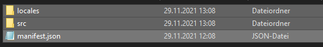
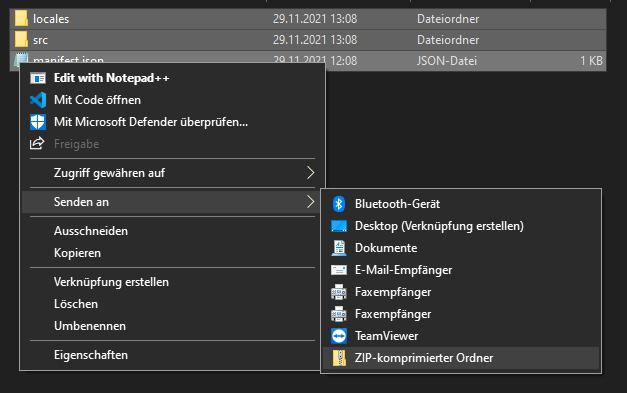

Diese Seite richtet sich in erster Linie an Entwickler, die einen Skill für mein System entwickeln möchten.  
Hier wird zunächst die Befehls- und Ordnerstruktur eines Skills beschrieben.  
Hat man alle Dateien wie beschrieben angelegt und sich überlegt, wie die einzelnen Befehle eines Skills aussehen sollen, kann man auf den Seiten zu den Locales-Dateien und zum SDK nachschauen wie ein solcher Skill erstellt wird.   
Anschließend findet man auf dieser Seite eine kurze Anleitung, wie man seinen Skill am besten verpackt, um ihn zu installieren. 

## Aufbau eines Befehls

Basierend auf dem Befehls-Aufbau von [Alexa](./../evaluation/amazonalexa.md) und dem [Google Assistant](./../evaluation/googleassistant.md) habe ich mich dazu entschlossen, einen sehr ähnlichen, wenn nicht sogar den gleichen Aufbau vorauszusetzen.  
Daher sieht der Aufbau der Befehle wie folgt aus:

``<wake word>, <launch> <Invocation name> <utterance>``

- ``wake word``: Das Wake Word ist das Wort, mit welchem man den Sprachassistenten "aufwecken" kann. Dieses wird von Rhasspy vorausgesetzt.
- ``launch``: Hierbei handelt es sich um eine Sammlung an Füllwörtern, welche in der [``defaults.json``](https://github.com/fwehn/pp-voiceassistant/blob/main/src/client/defaults.json) definiert wurden.
- ``invocation``: Das ist der Name, mit dem man den Skill auswählt, z.B. ``Hallo Welt`` für [HelloWorld](https://github.com/fwehn/pp-voiceassistant/blob/main/src/server/skills/HelloWorld/1.0/src/index.js).
- ``utterance``: Utterance ist der Unterbefehl, welcher die einzelnen Funktionen eines Skills darstellt.


## Ordner anlegen

Ich habe mich für folgende Ordnerstruktur (am Beispiel des [HelloWorld](https://github.com/fwehn/pp-voiceassistant/blob/main/src/server/skills/HelloWorld/1.0/src/index.js) Skills) entschieden.  
Diese ähnelt sehr stark der Struktur von Amazon.

```
HelloWorld   
│
├── 1.0
│   ├── manifest.json
│   │
│   ├── locales
│   │   ├── de_DE.json
│   │   └── en_US.json
│   │
│   └── src
│       └── index.js
│
└── <other-version-tag>
    ...
```

Jede Version eines Skills wird durch einen Ordner dargestellt.  
In jedem diese Ordner gibt es eine ``manifest.json`` und die beiden Unterordner ``src`` und ``locales``.  
In der ``manifest.json`` werden, für den Skill notwendige Angaben gespeichert, wie z.B. verschiedene [npm-dependencies](https://docs.npmjs.com/cli/v7/configuring-npm/package-json#dependencies), die für den Skill benötigt werden.  
Oder Variablen, welche der Endnutzer über das [Webinterface](./../client/webinterface.md#details) einstellen soll.  
Was in einer solchen ``manifest.json``-Datei stehen muss, habe ich [hier](./manifest.md) näher beschrieben.

Im Unterordner ``locales`` befinden sich die Dateien, welche den Aufbau eines Befehls definieren. Dabei handelt es sich bei jeder Datei um eine jeweilige Sprache bzw. Lokalisierung.

``de_DE.json`` -> deutscher Befehl  
``en_US.json`` -> amerikanisches Englisch

Die Dateien sind im JSON Format geschrieben.  
Den Aufbau einer solchen Datei findet man [hier](./locales.md).

Im Unterordner ``src`` befindet sich der gesamte Code des Befehls, welcher in JavaScript geschrieben sein muss.  
Dazu wird eine Datei mit dem Namen ``index.js`` benötigt.  
Ich habe ein [SDK](https://github.com/fwehn/pp-voiceassistant/tree/main/src/sdk) erstellt welches die Kommunikation zwischen Skill und Rhasspy übernimmt.  
Wie man dieses SDK benutzt habe ich [hier](./sdk.md) näher beschrieben.

Um die Erstellung neuer Skills zu vereinfachen, habe ich einen [Dummy](https://github.com/fwehn/pp-voiceassistant/tree/main/src/server/skills/_dummy) erstellt, aus dem man leicht einen neuen Skill anlegen kann.  

## Zip erstellen
Um möglichst einfach den SKill zu testen, muss man eine Zip-Datei erstellen.  
Diese kann dann über die [Uploadseite](./../client/webinterface.md#upload) des Webinterfaces einfach installiert werden.  
Wichtig ist dabei, dass man die Zip-Datei über die zwei oben genannten Verzeichnisse ``src`` und ``locales`` und die ``manifest.json`` erstellt und nicht aus dem Eltern-Verzeichnis.

### Windows
Unter Windows geht das Erstellen der Zip sehr einfach.  
1. Dazu einfach oben genannte Dateien auswählen.  
  
  
2. Auf "Senden an" klicken.  
3. Und "ZIP-komprimierter Ordner" auswählen.  
  
